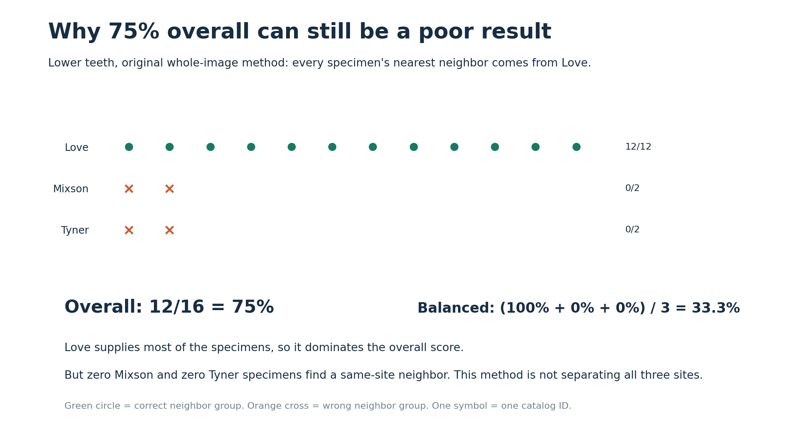
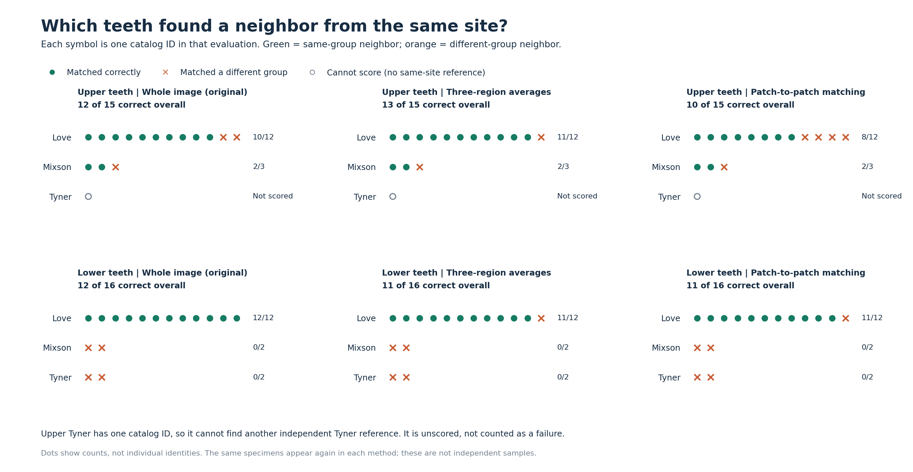
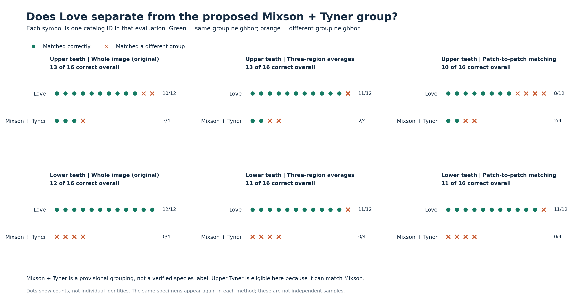
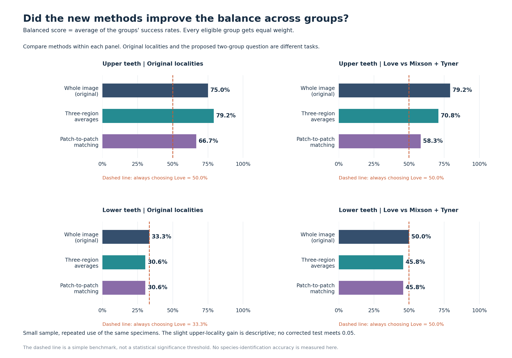

# What the tooth-matching results mean, visually

**The upper teeth show some same-site matching, with a small improvement from regional
averages. The lower teeth are not separating the smaller sites. We have not demonstrated
reliable species identification.** These charts explain the latest 12 regional evaluations.

For every specimen, DINOv3 finds the most visually similar **different catalog ID**.
We then check whether that neighbor belongs to the same locality or proposed group.
A correct match means agreement with that label; it does not mean a species was identified.

## 1. Why a high percentage can be misleading

There are 12 Love specimens and only four specimens from the other two sites combined.
The original whole-image method retrieves a Love neighbor for every lower specimen.
It gets 12 of 16 right, which is **75% overall**, while failing every Mixson and Tyner query.

The **balanced score** gives each site an equal say: Love gets 100%, Mixson 0%, and Tyner
0%. Their average is **33.3%**. This is why we cannot use the 75% number as evidence that
the method successfully separates the three sites.

## 2. See the actual successes and misses

Read across the upper row to compare the methods on upper teeth; do the same for the lower
row. Green circles are successful matches. Orange crosses are incorrect matches. Each symbol
is a catalog ID in that evaluation. The same IDs are reused across methods, and the symbols
are arranged by outcome rather than individual identity.

- **Upper regional averages:** 13/15 correct instead of 12/15. Love improves from 10/12 to
  11/12; Mixson stays at 2/3. Two Love specimens improve and one worsens, giving a net gain
  of one. It is a small change, not a broad improvement across sites.
- **Lower regional methods:** Mixson and Tyner still have zero correct matches. Love also
  loses a correct match, so these methods do not improve the lower analysis.
- **Upper Tyner:** the hollow circle is unscored. It has only one independent catalog ID,
  so there is no different Tyner specimen to retrieve. Two photographs of that ID do not
  provide two independent specimens.

The methods are: **whole image**, the original summary vector; **three-region averages**,
separate summaries of three geometric crown bands; and **patch-to-patch matching**, which
compares smaller image regions within those bands. The bands are not verified anatomical
landmarks, and the model still saw the full crop.

## 3. The proposed grouping is a separate question

Here we allow Mixson and Tyner to match each other. That also makes upper Tyner eligible
as a query, so all 16 upper IDs are scored. This is a provisional locality grouping,
not a set of verified species labels.

For upper teeth, whole-image and regional-average methods both get **13/16 overall**.
But the distribution changes:

| Method | Love | Mixson + Tyner | Balanced score |
| --- | ---: | ---: | ---: |
| Whole image | 10/12 = 83.3% | 3/4 = 75.0% | 79.2% |
| Three-region averages | 11/12 = 91.7% | 2/4 = 50.0% | 70.8% |

Gaining one Love match raises Love recall by about eight percentage points. Losing one
minority-group match lowers its recall by 25 points. Giving the groups equal weight therefore
produces a lower balanced score, despite the unchanged total. This is why the two scores
can tell different stories.

## 4. Compare methods on the same question

Longer bars mean better balanced matching. Compare bars **within a panel**: changing from
three localities to two groups changes what counts as correct, so a larger bar across
different panels is not necessarily an improvement on the same task.

The dashed line shows the score from **always choosing Love**. It is a simple benchmark,
not the statistical threshold or the expected score under shuffled labels. Being above
it is useful descriptively, but does not by itself demonstrate a dependable improvement.

## What about the p-values?

Those answer a different question: if we shuffled the labels while preserving group sizes,
how often would the balanced score be at least this high? We also adjust for trying 12
comparisons. None of the adjusted results meets the 0.05 threshold used here.

That means **we do not yet have convincing statistical evidence of separation with these
methods and this dataset**. It does not prove the sites are biologically identical. The
sample is small, especially at Mixson and Tyner; the same teeth have been used repeatedly;
and wear, preservation and photography have not been controlled. The scores are not
percentages of certainty about species identity.

## What to take away

The regional-average result offers one extra upper-locality match to inspect, but it
does not improve the proposed Love versus Mixson + Tyner grouping. Lower-tooth matches
remain dominated by Love. The tooth-pair review can help determine whether matches follow
corresponding anatomy or other visual similarities; the graphs alone cannot tell us that.

Refresh `outputs/dinov3_regional_v1/index.html` for these graphs above the numerical tables.
Use `outputs/dinov3_regional_v1/review.html` to inspect the actual tooth correspondences.
The [detailed results](dinov3-regional-results-v1.md) retain the complete tables and limitations.

Charts are generated directly from the [saved numerical results](results/regional-results-v1.json)
with `python scripts/visualize_dinov3_regional.py`. PNG files can be used in slides; SVG files
in the same folder remain sharp when resized. No inference, scores, labels or statistical
tests are changed by generating these visuals.
