# Tooth morphology photo gallery

This preserves the 23 September 2026 literature and photo review, including all **37 photographs**, observations, catalog evidence and unresolved identifications. No new species assignments were made.

**Scroll down to view the teeth directly on GitHub.** For the original interactive layout and filters, open [index.html](index.html), select **Download raw file**, and open the downloaded file in your browser. All photographs and the evidence CSV are embedded in that HTML file; no Python, model weights or additional image downloads are needed. Links to papers and written guides require internet access.

[Written assessment](../molar-morphology-assessment-v1.md) | [Primary-literature guide](../molar-taxonomy-primary-literature.md) | [Specimen evidence CSV](specimen_evidence.csv)

## How to read the photographs

Look for complete crosswise ridges, smaller accessory cusps, clover-like wear outlines and the terminal crown structure. Use combinations of features; ridge counts and cusp patterns overlap between taxa. Images are independently resized, so on-screen lengths are not comparable physical measurements.

These JPEGs are compressed viewing copies of the reviewed crops, with the recorded quarter turns and no reflection. They retain the existing crop exclusions. They are not measurement inputs or replacements for the original photographs. Assistant observations are preliminary; anatomical orientation and formal character scores remain unverified.

**Priority discrepancy:** UF 212304's filenames indicate m3, while a published specimen description lists m1/m2. Resolve the position before using those two photos as confirmed third-molar references.

## Evidence overview

The 32 catalog/position rows comprise 12 Gomphotherium catalog associations, 12 broad Amebelodontinae associations, 2 floridanus catalog candidates, 2 published floridanus reference numbers, 1 tooth-position conflict and 3 unresolved reference identities. These are evidence categories, not predicted species. Exact catalog-number matches do not authenticate the photographs.

Museum catalog data: University of Florida Vertebrate Paleontology via iDigBio; provider rights field CC4 BY-NC. That attribution concerns catalog data, not a new license for the specimen photographs.

## Upper teeth

### UF-276840 - filename side: left

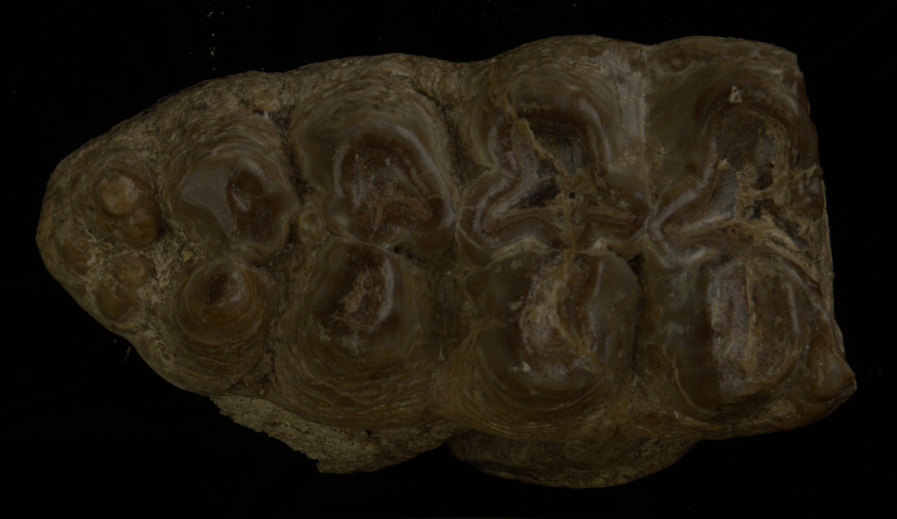

**Visible in this photo:** Worn enamel outlines include curved, trefoil-like forms. Attached material limits some crown margins.

**Catalog: Amebelodontinae:** Broad catalog identification; not a verified genus or species, and not proof of a second Love taxon. [Evidence source](https://portal.idigbio.org/portal/records/ee21bbad-9b2c-4779-9a0e-f80b4e8baec7).

Photo: `Love Bone Bed Upper M3/UF-276840-01-LUM3.png`

### UF-38231 - filename side: right

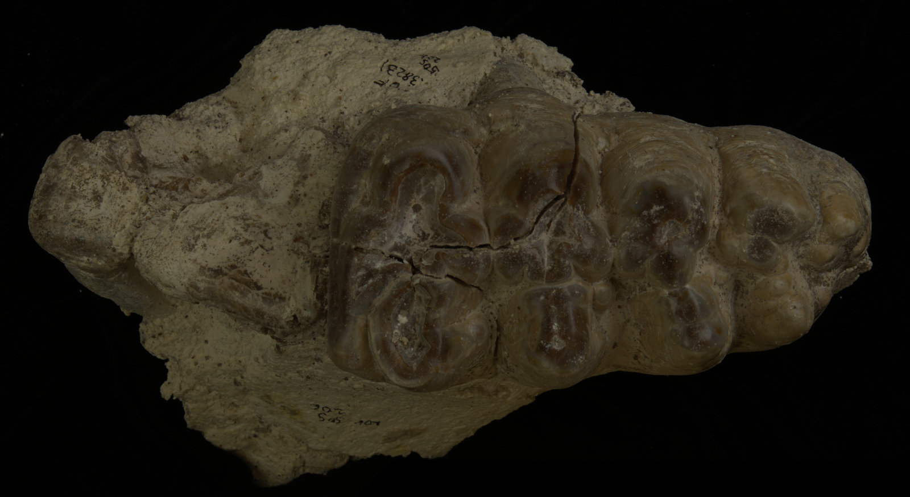

**Visible in this photo:** Attached jaw or matrix obscures the image-left end; exposed worn crown surfaces remain visible.

**Catalog: Gomphotherium:** Genus-level catalog label; species and photo identity are unverified. [Evidence source](https://portal.idigbio.org/portal/records/adf44eeb-4d9f-4be7-9a45-bbcb24adfe57).

Photo: `Love Bone Bed Upper M3/UF-38231-01-RUM3.png`

### UF-38232 - filename side: right

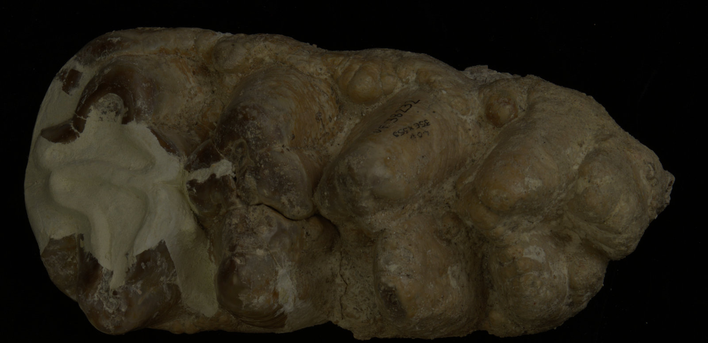

**Visible in this photo:** Dark crown, cracks and pale material near the image-left end make completeness difficult to assess.

**Catalog: Gomphotherium:** Genus-level catalog label; species and photo identity are unverified. [Evidence source](https://portal.idigbio.org/portal/records/454727c2-b45a-4438-b3a1-352067fbc8cd).

Photo: `Love Bone Bed Upper M3/UF-38232-01-RUM3.png`

### UF-38233 - filename side: left

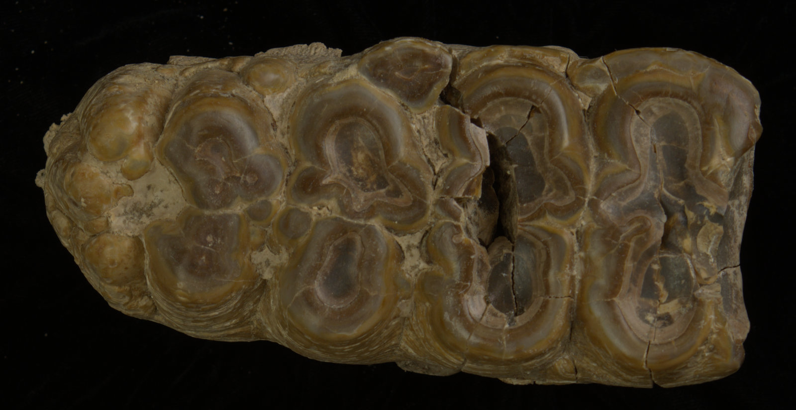

**Visible in this photo:** Trefoil-like worn outlines are visible, with a large central crack or missing area.

**Catalog: Gomphotherium:** Genus-level catalog label; species and photo identity are unverified. [Evidence source](https://portal.idigbio.org/portal/records/083436bb-2473-439f-8e63-50e5f5de07d3).

Photo: `Love Bone Bed Upper M3/UF-38233-01-LUM3.png`

### UF-38234 - filename side: left

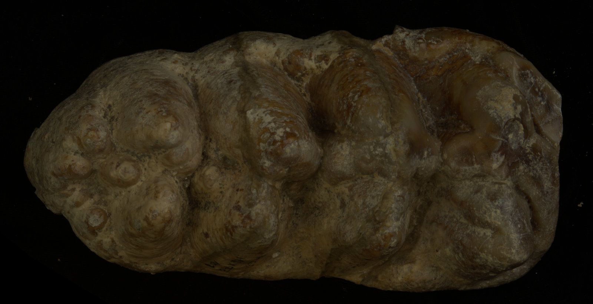

**Visible in this photo:** Raised rounded cusps and paired transverse rows are relatively readable; useful for a closer cusp review.

**Catalog: Amebelodontinae:** Broad catalog identification; not a verified genus or species, and not proof of a second Love taxon. [Evidence source](https://portal.idigbio.org/portal/records/6876bb4b-ccc1-422a-95fe-25bda8f664fe).

Photo: `Love Bone Bed Upper M3/UF-38234-01-LUM3.png`

### UF-38235 - filename side: left

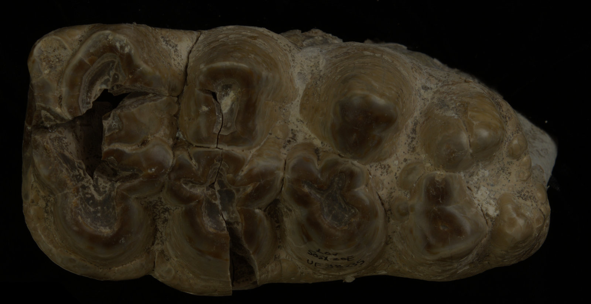

**Visible in this photo:** Large breaks between crown portions interrupt the worn ridge pattern.

**Catalog: Gomphotherium:** Genus-level catalog label; species and photo identity are unverified. [Evidence source](https://portal.idigbio.org/portal/records/df7b5705-19de-4f40-86e7-ba4616f786ce).

Photo: `Love Bone Bed Upper M3/UF-38235-01-LUM3.png`

### UF-38237 - filename side: left

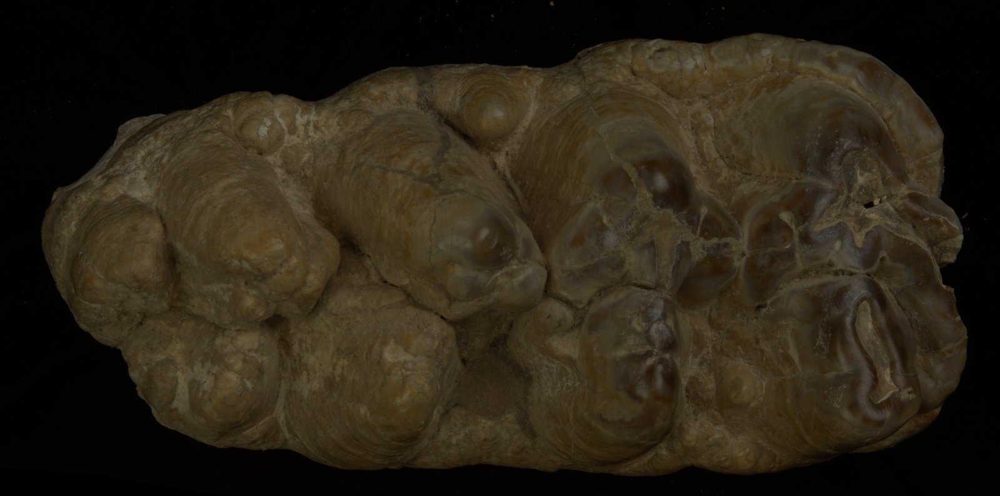

**Visible in this photo:** Wear varies along the crown: raised cusps at one end and flatter worn surfaces at the other.

**Catalog: Amebelodontinae:** Broad catalog identification; not a verified genus or species, and not proof of a second Love taxon. [Evidence source](https://portal.idigbio.org/portal/records/67c353d3-39b9-4784-bbe0-6a1b12a98fde).

Photo: `Love Bone Bed Upper M3/UF-38237-01-LUM3.png`

### UF-38239 - filename side: left

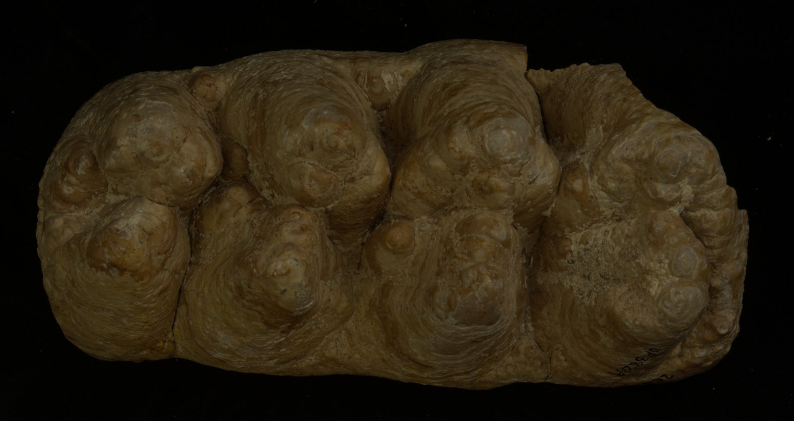

**Visible in this photo:** Raised rounded cusps are visible; a notch or missing area interrupts the upper image margin.

**Catalog: Amebelodontinae:** Broad catalog identification; not a verified genus or species, and not proof of a second Love taxon. [Evidence source](https://portal.idigbio.org/portal/records/1aa73859-a2dd-4157-9234-aea130c218ff).

Photo: `Love Bone Bed Upper M3/UF-38239-01-LUM3.png`

### UF-38240 - filename side: right

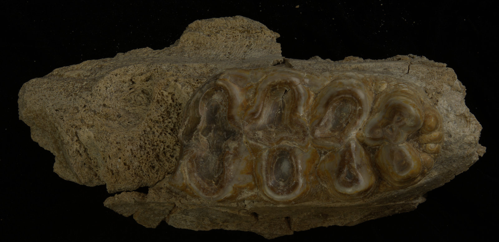

**Visible in this photo:** Extensive attached material accompanies flattened, curved wear outlines; a complete crown outline is difficult to trace.

**Catalog: Gomphotherium:** Genus-level catalog label; species and photo identity are unverified. [Evidence source](https://portal.idigbio.org/portal/records/bb89fee1-f04a-435e-bdd6-f7d8d3241388).

Photo: `Love Bone Bed Upper M3/UF-38240-03-RUM3.png`

### UF-38243 - filename side: right

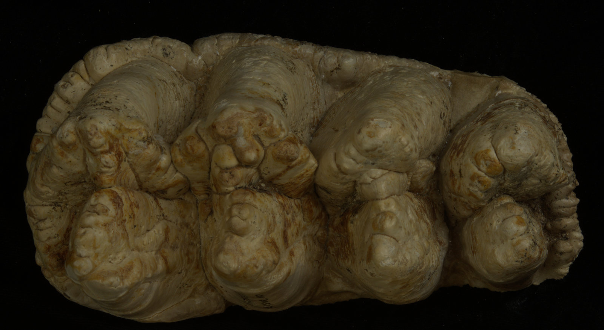

**Visible in this photo:** Raised main cusps and smaller accessory knobs are visible; useful for a closer cusp review.

**Catalog: Amebelodontinae:** Broad catalog identification; not a verified genus or species, and not proof of a second Love taxon. [Evidence source](https://portal.idigbio.org/portal/records/cd1e4ae2-f930-4944-a1be-ca4cfc1c9802).

Photo: `Love Bone Bed Upper M3/UF-38243-01-RUM3.png`

### UF-38244 - filename side: right

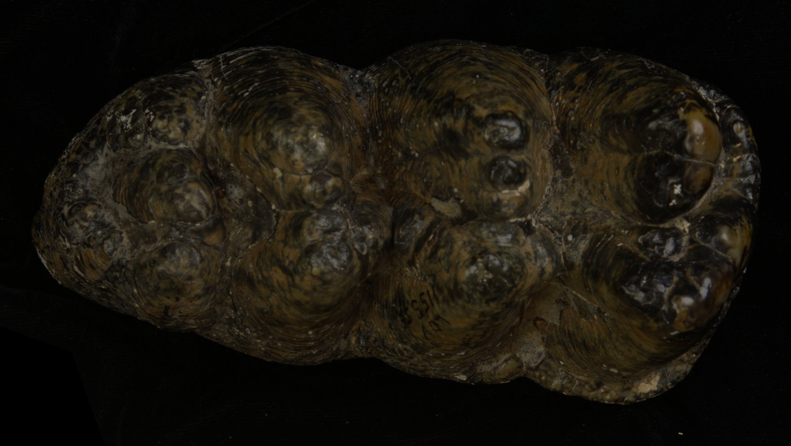

**Visible in this photo:** Dark areas and specular glare obscure some cusp surfaces.

**Catalog: Gomphotherium:** Genus-level catalog label; species and photo identity are unverified. [Evidence source](https://portal.idigbio.org/portal/records/f5d95f61-6329-4144-8d32-d2871b7329f9).

Photo: `Love Bone Bed Upper M3/UF-38244-01-RUM3.png`

### UF-38247 - filename side: right

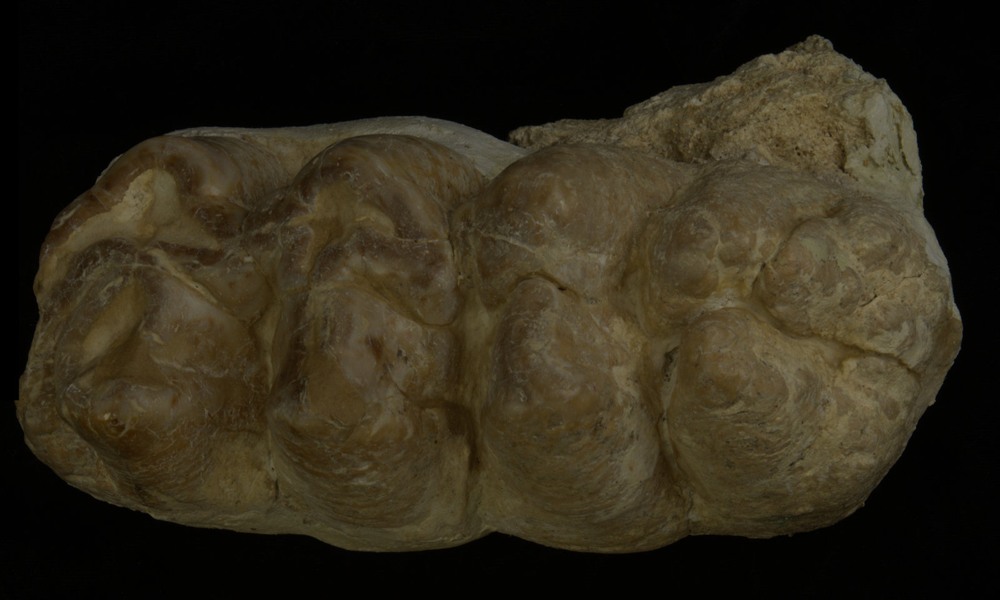

**Visible in this photo:** Attached material near the image-right end limits assessment of the terminal crown outline.

**Catalog: Amebelodontinae:** Broad catalog identification; not a verified genus or species, and not proof of a second Love taxon. [Evidence source](https://portal.idigbio.org/portal/records/1f9a92cb-4140-47bf-8b2a-091c7b5d4595).

Photo: `Love Bone Bed Upper M3/UF-38247-01-RUM3.png`

### USNM-3080 - filename side: right

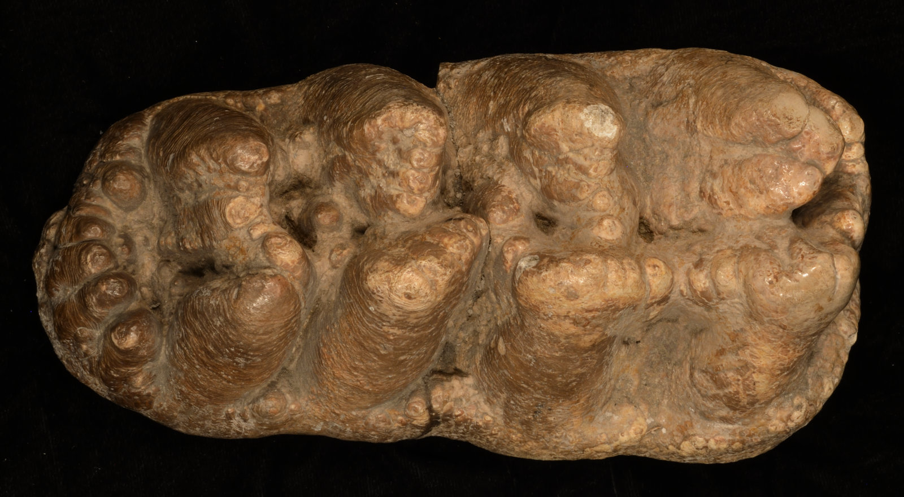

**Visible in this photo:** Large rounded cusps and constricted spaces between them are visible. Exact taxonomic identity remains unverified.

**No exact reference verified:** Locality alone does not identify this tooth. Seek its collection record and associated material.

Photo: `Mixson's Bone Bed/USNM-3080-01-RUM3.png`

### USNM-3084 - filename side: right

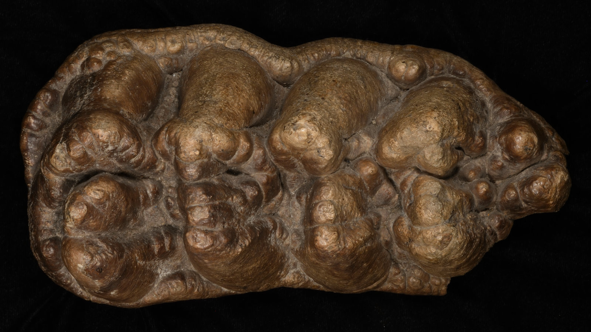

**Visible in this photo:** Rounded cusps, accessory structures and a smaller terminal complex are visible. Compare with the published plate for this catalog number.

**Published floridanus reference:** Exact catalog number and third-molar position occur in Lambert (2023). Photo identity still needs verification. [Evidence source](https://doi.org/10.1080/02724634.2023.2252021).

Photo: `Mixson's Bone Bed/USNM-3084-01-RUM3.png`

### USNM-3085 - filename side: left

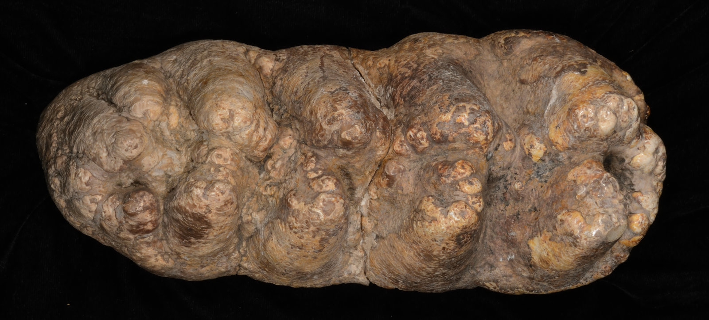

**Visible in this photo:** Worn surfaces and material within the central crown obscure some smaller structures.

**No exact reference verified:** Locality alone does not identify this tooth. Seek its collection record and associated material.

Photo: `Mixson's Bone Bed/USNM-3085-01-LUM3.png`

### UF-212305 - filename side: left

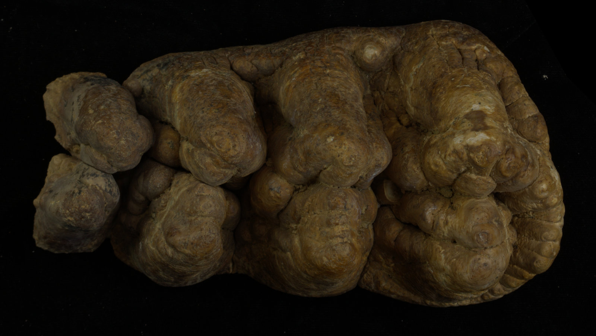

**Visible in this photo:** Raised cusps remain visible; a fracture or missing portion at the image-left end limits full-crown scoring.

**Catalog: floridanus:** Amebelodon/Stenobelodon placement is disputed; this is a catalog association. [Evidence source](https://portal.idigbio.org/portal/records/3f4f11bf-c9fe-4695-80bc-070dad47a278).

Photo: `Tyner Farm/UF-212305-01-LUM3.png`

### UF-212305 - filename side: right

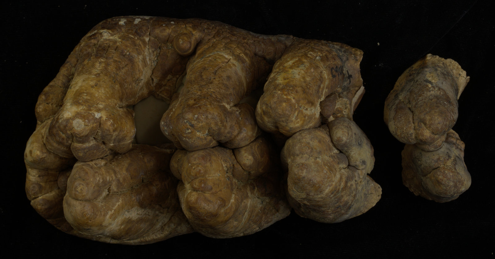

**Visible in this photo:** A detached tooth portion lies to image-right. The main fragment alone cannot supply a complete ridge count.

**Catalog: floridanus:** Amebelodon/Stenobelodon placement is disputed; this is a catalog association. [Evidence source](https://portal.idigbio.org/portal/records/3f4f11bf-c9fe-4695-80bc-070dad47a278).

Photo: `Tyner Farm/UF-212305-01-RUM3.png`

## Lower teeth

### UF-38208 - filename side: right

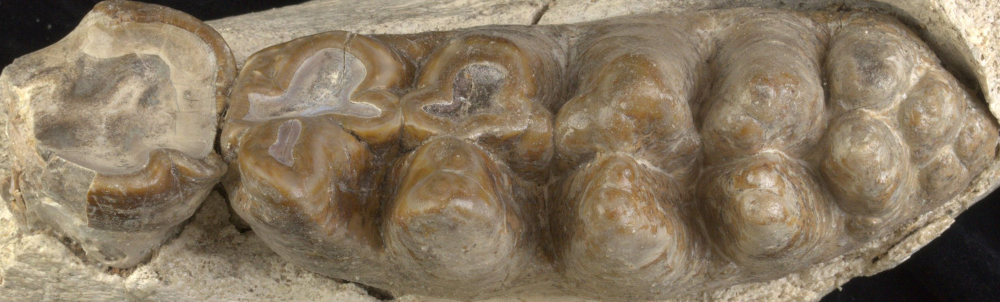

**Visible in this photo:** Wear varies strongly along the crown; worn curved outlines contrast with more raised cusps at the other end.

**Catalog: Gomphotherium:** Genus-level catalog label; species and photo identity are unverified. [Evidence source](https://portal.idigbio.org/portal/records/6f7f7272-1afe-41d0-91f6-c0133f06680a).

Photo: `Love_Bone_Bed/LBB-UF-38208-RL_occlusal.png`

### UF-38213 - filename side: right

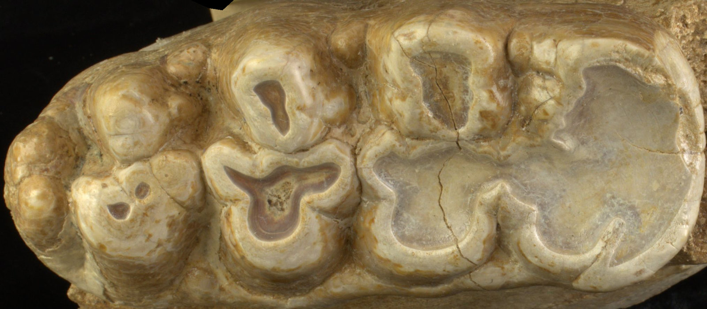

**Visible in this photo:** Trefoil-like wear outlines are more conspicuous in one half of the image than the other. Anatomical side requires verification.

**Catalog: Gomphotherium:** Genus-level catalog label; species and photo identity are unverified. [Evidence source](https://portal.idigbio.org/portal/records/1a97ddfb-1ebf-40ad-bada-b6578070c496).

Photo: `Love_Bone_Bed/LBB-UF-38213-RL_occlusal.png`

### UF-38215 - filename side: left

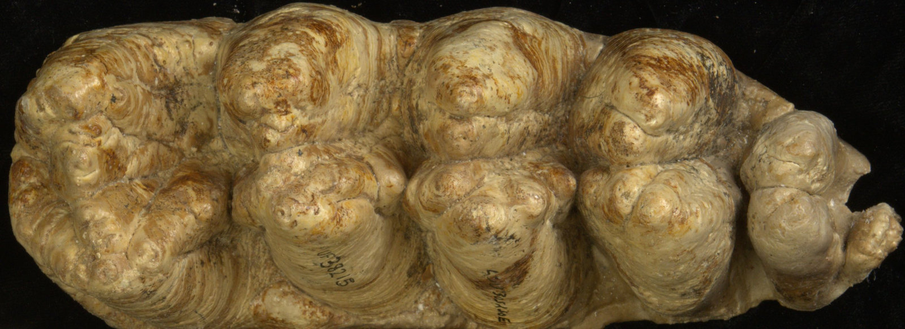

**Visible in this photo:** Raised rounded cusps are visible; damage near image-right and a tight lower margin require review.

**Catalog: Amebelodontinae:** Broad catalog identification; not a verified genus or species, and not proof of a second Love taxon. [Evidence source](https://portal.idigbio.org/portal/records/c4c3b3fb-18de-42c6-b12e-570e830b9359).

Photo: `Love_Bone_Bed/LBB-UF-38215-LL_occlusal.png`

### UF-38215 - filename side: right

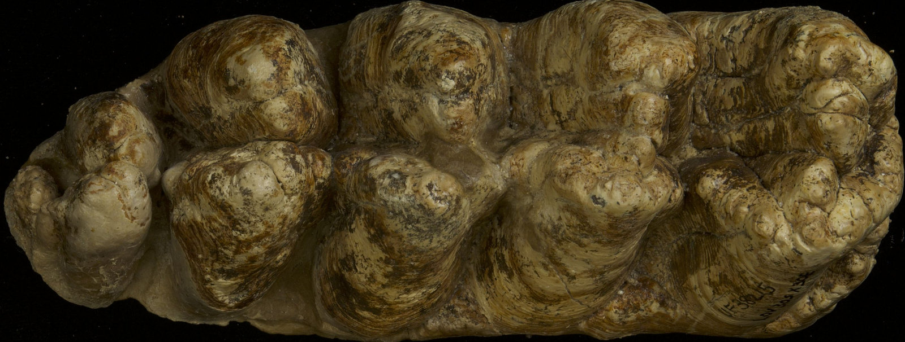

**Visible in this photo:** Raised cusps are dark and partly obscured by surrounding material; the upper image margin is tight.

**Catalog: Amebelodontinae:** Broad catalog identification; not a verified genus or species, and not proof of a second Love taxon. [Evidence source](https://portal.idigbio.org/portal/records/c4c3b3fb-18de-42c6-b12e-570e830b9359).

Photo: `Love_Bone_Bed/LBB-UF-38215-RL_occlusal.png`

### UF-38216 - filename side: right

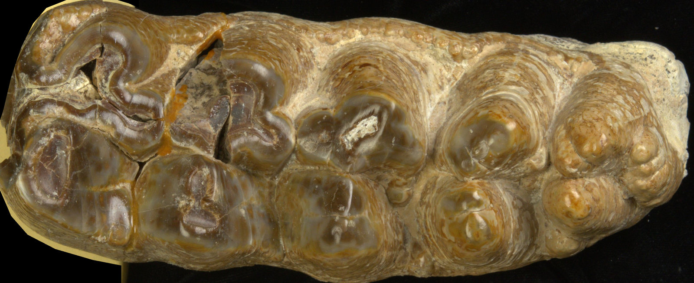

**Visible in this photo:** Worn curved outlines accompany cracks and damage near the image-left end.

**Catalog: Amebelodontinae:** Broad catalog identification; not a verified genus or species, and not proof of a second Love taxon. [Evidence source](https://portal.idigbio.org/portal/records/062e7b7d-e430-42c1-abf4-bb450296f260).

Photo: `Love_Bone_Bed/LBB-UF-38216-RL_occlusal.png`

### UF-38218 - filename side: right

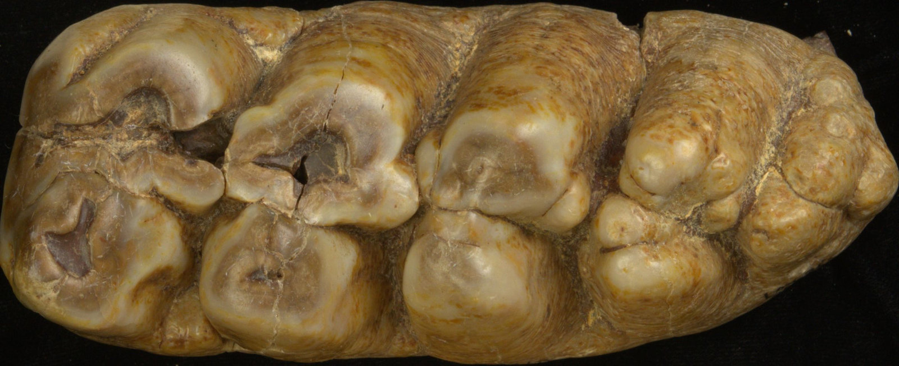

**Visible in this photo:** Cracked, worn surfaces near image-left contrast with more raised cusps toward image-right.

**Catalog: Amebelodontinae:** Broad catalog identification; not a verified genus or species, and not proof of a second Love taxon. [Evidence source](https://portal.idigbio.org/portal/records/a8e5fdcb-987d-42ee-8b26-47a14c45a1c3).

Photo: `Love_Bone_Bed/LBB-UF-38218-RL_occlusal.png`

### UF-38220 - filename side: right

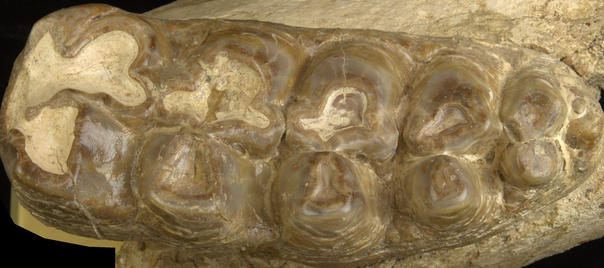

**Visible in this photo:** Trefoil-like outlines in the upper half of the image contrast with rounder outlines below. Useful for teaching wear-pattern asymmetry, not a genus diagnosis.

**Catalog: Gomphotherium:** Genus-level catalog label; species and photo identity are unverified. [Evidence source](https://portal.idigbio.org/portal/records/884fdd73-86f7-4449-9ddb-40f2b5293600).

Photo: `Love_Bone_Bed/LBB-UF-38220-RL_occlusal.png`

### UF-38221 - filename side: left

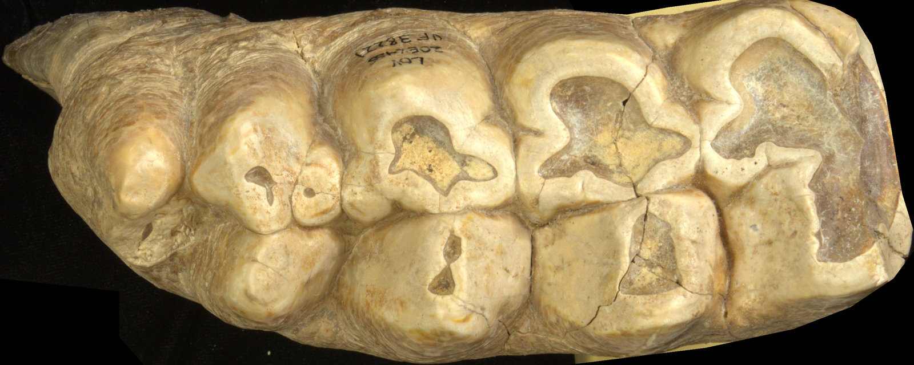

**Visible in this photo:** Extensive wear at image-right may have erased smaller cusp structures; cracks are also visible.

**Catalog: Amebelodontinae:** Broad catalog identification; not a verified genus or species, and not proof of a second Love taxon. [Evidence source](https://portal.idigbio.org/portal/records/353fcb43-f67c-4fd9-a99f-6a95696dcb92).

Photo: `Love_Bone_Bed/LBB-UF-38221-LL_occlusal.png`

### UF-38223 - filename side: right

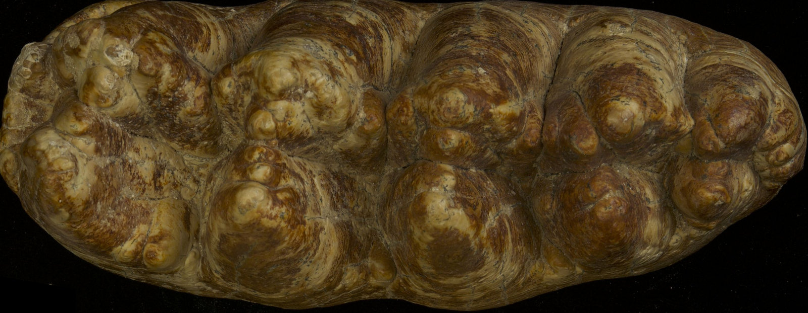

**Visible in this photo:** Raised main cusps and smaller knobs are visible, but dark areas and the tight upper margin limit scoring.

**Catalog: Amebelodontinae:** Broad catalog identification; not a verified genus or species, and not proof of a second Love taxon. [Evidence source](https://portal.idigbio.org/portal/records/1d274c55-389f-4f9c-9109-979ad9cc53b4).

Photo: `Love_Bone_Bed/LBB-UF-38223-RL_occlusal.png`

### UF-38226 - filename side: right

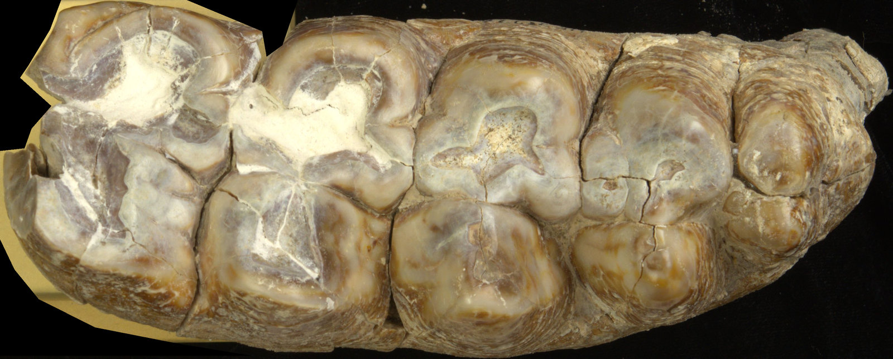

**Visible in this photo:** Pale areas and fractures interrupt the crown; do not interpret every pale or dark boundary as anatomy.

**Catalog: Amebelodontinae:** Broad catalog identification; not a verified genus or species, and not proof of a second Love taxon. [Evidence source](https://portal.idigbio.org/portal/records/deb8aa1c-e530-4b10-bd1c-77819dcbbcf4).

Photo: `Love_Bone_Bed/LBB-UF-38226-RL_occlusal.png`

### UF-38228 - filename side: right

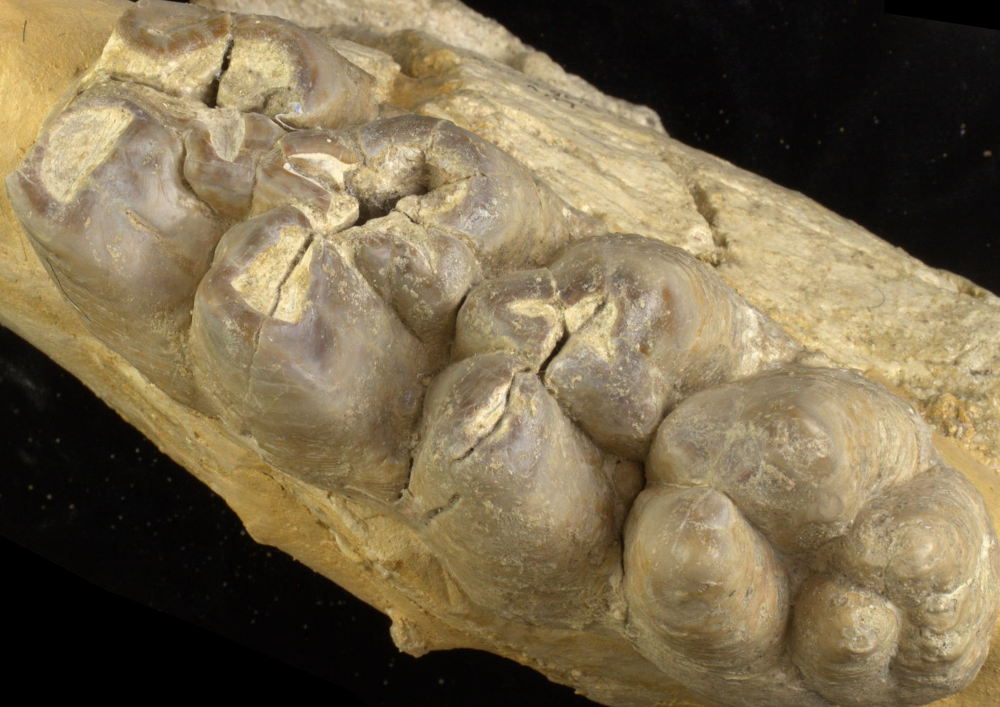

**Visible in this photo:** The crown is oblique within the image and includes cracks. Camera perspective and complete margins require checking before proportions are measured.

**Catalog: Gomphotherium:** Genus-level catalog label; species and photo identity are unverified. [Evidence source](https://portal.idigbio.org/portal/records/60852bdc-c83c-4b0f-9b6d-a5577c1a996b).

Photo: `Love_Bone_Bed/LBB-UF-38228-RL_occlusal.png`

### UF-38241 - filename side: left

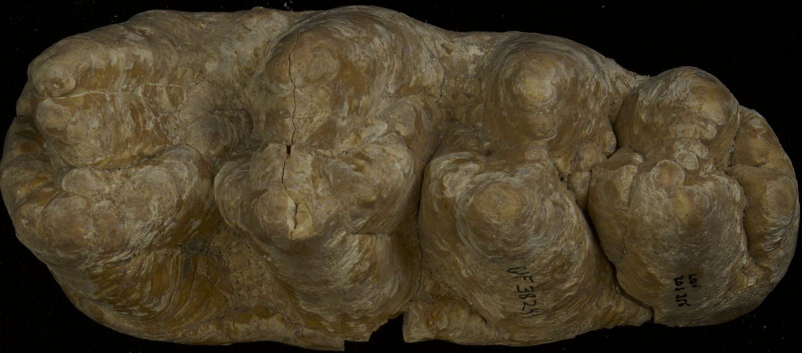

**Visible in this photo:** A large crack or break interrupts the lower central crown; writing on the tooth remains visible.

**Catalog: Gomphotherium:** Genus-level catalog label; species and photo identity are unverified. [Evidence source](https://portal.idigbio.org/portal/records/8c3802c5-c81a-4037-a86e-70702e114d2f).

Photo: `Love_Bone_Bed/LBB-UF-38241-LL_occlusal.png`

### UF-38249 - filename side: left

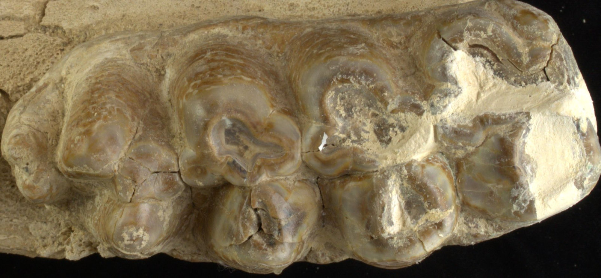

**Visible in this photo:** A large pale chipped or missing area at image-right limits interpretation of that end.

**Catalog: Gomphotherium:** Genus-level catalog label; species and photo identity are unverified. [Evidence source](https://portal.idigbio.org/portal/records/efedb32b-8b57-4b54-8861-82999d86332d).

Photo: `Love_Bone_Bed/LBB-UF-38249-LL_occlusal.png`

### UF-38249 - filename side: right

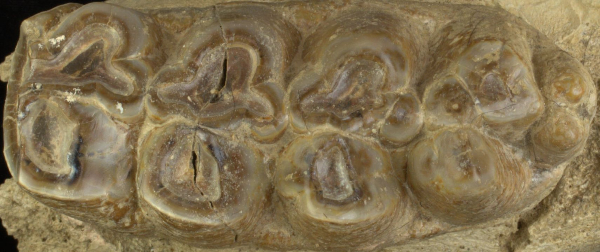

**Visible in this photo:** Several worn enamel outlines and cracks are visible; surrounding material complicates the margins.

**Catalog: Gomphotherium:** Genus-level catalog label; species and photo identity are unverified. [Evidence source](https://portal.idigbio.org/portal/records/efedb32b-8b57-4b54-8861-82999d86332d).

Photo: `Love_Bone_Bed/LBB-UF-38249-RL_occlusal.png`

### USNM-3082 - filename side: unknown

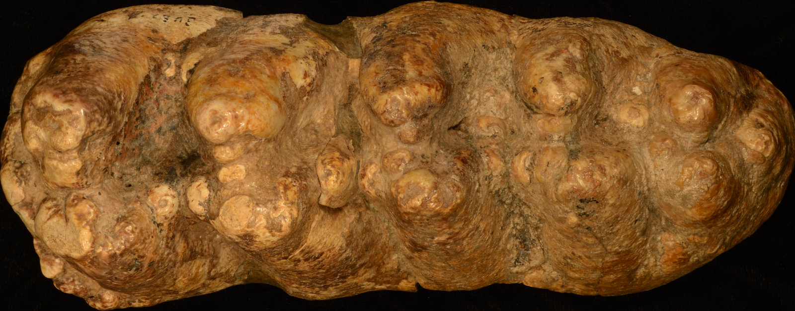

**Visible in this photo:** Rounded cusps and smaller structures are visible around central matrix; the upper crown margin is tightly clipped.

**No exact reference verified:** Locality alone does not identify this tooth. Seek its collection record and associated material.

Photo: `Mixsons_Bone_Bed/Mixson_USNM-3082_occlusal.png`

### USNM-3083 - filename side: unknown

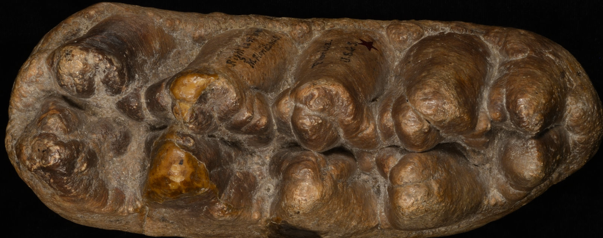

**Visible in this photo:** Raised cusps and small intervening structures are visible. Compare with the published plate for this catalog number.

**Published floridanus reference:** Exact catalog number and third-molar position occur in Lambert (2023). Photo identity still needs verification. [Evidence source](https://doi.org/10.1080/02724634.2023.2252021).

Photo: `Mixsons_Bone_Bed/Mixson_USNM-3083_occlusal.png`

### UF-212304 - filename side: left

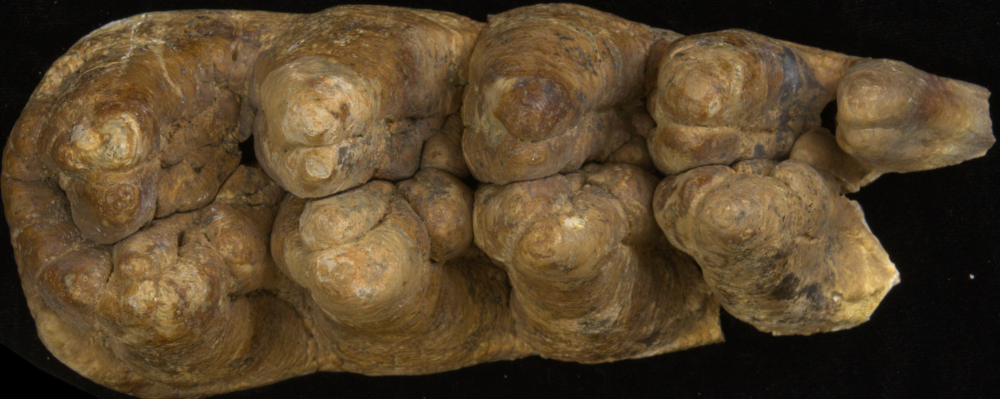

**Visible in this photo:** Raised cusp rows are visible, but the filename tooth position conflicts with a published catalog description. Resolve position before third-molar scoring.

**Resolve tooth position:** Catalog: floridanus; paper lists m1/m2, filenames claim m3. [Evidence source](https://doi.org/10.1080/02724634.2023.2252021).

Photo: `Tyner_Farm/Tyner_UF-212304_LL_occlusal.png`

### UF-212304 - filename side: right

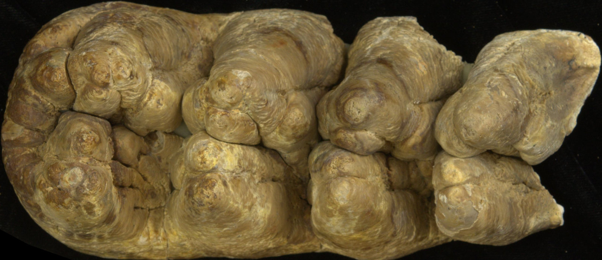

**Visible in this photo:** Raised cusp rows and damaged margins are visible. The filename tooth position conflicts with a published catalog description.

**Resolve tooth position:** Catalog: floridanus; paper lists m1/m2, filenames claim m3. [Evidence source](https://doi.org/10.1080/02724634.2023.2252021).

Photo: `Tyner_Farm/Tyner_UF-212304-RL_occlusal.png`

### UF-217472 - filename side: left

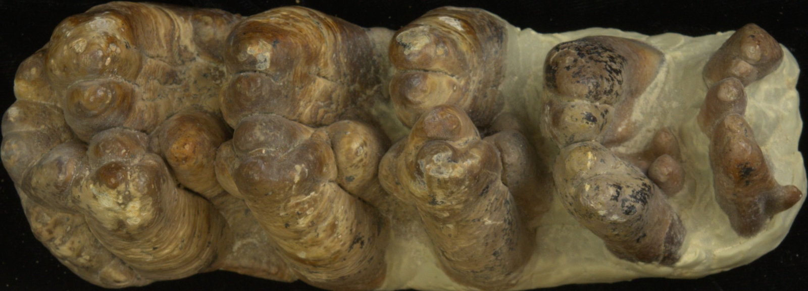

**Visible in this photo:** Pale surrounding material obscures part of the image-right crown; cusp tips remain visible.

**Catalog: floridanus:** Amebelodon/Stenobelodon placement is disputed; this is a catalog association. [Evidence source](https://portal.idigbio.org/portal/records/1ae00a91-4b76-4f6d-8fe3-7fb6d74b3740).

Photo: `Tyner_Farm/Tyner_UF-217472-LL_occlusal.png`

### UF-217472 - filename side: right

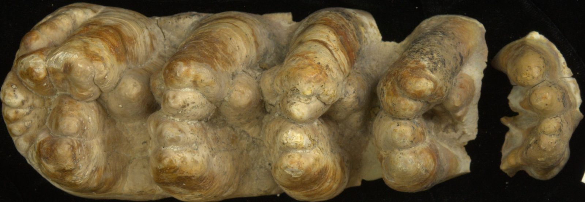

**Visible in this photo:** A detached terminal-looking portion lies to image-right. Confirm its association and orientation before counting the complete tooth.

**Catalog: floridanus:** Amebelodon/Stenobelodon placement is disputed; this is a catalog association. [Evidence source](https://portal.idigbio.org/portal/records/1ae00a91-4b76-4f6d-8fe3-7fb6d74b3740).

Photo: `Tyner_Farm/Tyner_UF-217472-RL_occlusal.png`

